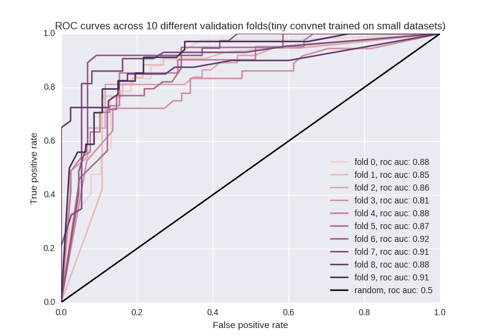

# University of Auckland Data Science Club X-Traige Entry

To get the ball rolling, here's the code for our experiments so far. It's more a proof of concept to build on than a finished product.
Includes scripts to preprocess the data and train a (very) basic convolutional neural network to classify x-rays into "normal" or "abnormal", and utils for running cross validation and finding auc.

## Limitations
So far, it only trains on the two smaller datasets. I did load the large DICOM dataset and the labels from the scraper, but was unable to get the same model to learn anything - performed no differently to random labels. I think this is because either:
- a) Something is wrong with my code to load data and labels - the functions for loading are still in prepro.py
- b) Something went wrong with Robin's scraper
- c) Something is going wrong with the REST API - I did notice the filenames from the API were for .pngs, whereas the data itself was in DICOM - odd.

The data has a lot of other issues as well, such as multiple x-ray views(side-on vs front-on) that have incorrect labels in the DICOM file header.

### Implementation details
Training was done on a GTX970 with a pentium G4400, and took less than a second per epoch - probably fast enough to run on CPU.
The model is a very simple, very small convolutional neural net. The first conv layer has 16 7x7 filters convolved with stride 3, the second has 16 3x3 filters, both have ReLU nonlinearities. Output is a single sigmoid unit and dropout is used to prevent overfitting. The CNN has binary cross entropy between its outputs and the targets(normal=0,abnormal=1)  as a loss function and is trained using the [adam](https://arxiv.org/abs/1412.6980) optimizer with a learning rate of 0.001. I spent very little time on hyperparameter tuning so this architecture could easily be improved.

 10x10 fold cross validation was done by splitting all 802 examples into 9 folds of 80 and 1 of 82. Each fold was used once for cross validation while the model trained on the rest of the dataset, and the neural net's weights/biases were initialised to the exact same values for each fold. Validation set ROC and safe set % were recorded for each fold, see k_fold_crossvalidation in util.py for details.

Safe set % was calculated by incrementing a 'threshold' from 0, finding the true negative/false negative rates of the model at that threshold, stopping when the number of false negatives was greater than a certain tolerance. See safeset_percent in util.py for details.
If you have any questions, feel free to message me on the meetup board(name: Soren Bouma) or open an issue.


## Results
Running 10x10-fold cross validation it averages an auc of 0.85 ± 0.07. Here is an example of what the roc curves look like:


Estimating the safe set % is difficult and unreliable when there is so little data. The model filtered out on average 27% of normal x-rays while getting a single false negative(out of 80 val examples). This was tested with 10 way cross validation, and there was a lot of variance in safe set% across different splits - 10% to 65%.

This probably isn't good enough to be useful yet, but it's a pretty decent first step considering this is only using a tenth of the avaliable data and the model trains in ~8 seconds. Notably, it gets higher AUC than the commercially available TB detection software [CAD4TB](http://www.diagnijmegen.nl/index.php/CAD4TB) does(0.71 to 0.84), according to [this review](https://www.ncbi.nlm.nih.gov/pubmed/27510250).

## Steps to reproduce
Everything was tested on Ubuntu 16.04 with python 2.7.12, gcc 5.4.0, cuda 8 and cudnn 5, but should work on any unix system.
### Installing dependencies
This uses the standard scientific python stack(scipy+numpy+matplotlib),scikit-learn,seaborn and the deep learning library [keras](keras.io).
 All dependencies can be installed with pip(you might have to run pip as root):
```bash
git clone https://github.com/UOADataScience/auckland-ai-meetup-x-triage
cd auckland-ai-meetup-x-triage/UoA-DSC-Experiments
pip install -r requirements.txt
```
### GPU
If you want to train on GPU, make sure you also have the NVIDIA drivers, a recent version of CUDA and CUDNN installed and tensorflow or theano is built with GPU support.
### Preprocessing data, building a model and training:
First, download and unzip the 2 smaller datasets:
- https://openi.nlm.nih.gov/imgs/collections/NLM-MontgomeryCXRSet.zip
- https://openi.nlm.nih.gov/imgs/collections/ChinaSet_AllFiles.zip

Run the script to preprocesses the data, storing the preproccesed data in SAVEPATH. --res allows you to optionally set the resolution of data and defaults to (256,256)
```bash
python prepare_smallsets.py --dir /path/to/ChinaSet_AllFiles /path/to/MontgomerySet --savepath SAVEPATH --res 256 256
```
Now the data is pickled in a tuple of a ndarray of images and a list of labels, ready for a neural net. To load it into python, simply use:
```python
import dill as pickle
with open(SAVEPATH,"r") as f:
	(X,y) = pickle.load(f)
```
To run 10-way cross validation and plot the ROCs:
```bash
python train.py --datapath SAVEPATH
```

## TODO
- Figure out what I've done wrong with the large dicom datasets labels (priority: highest)
- plot safe set % vs dataset size (priority: very high)
- Test on OSX
- Test on Windows - might require a few modifications to work
- Test with theano backend
- Test with python3
- Write instructions to install dependencies using anaconda or virtualenv, rather than pip
- Write script to get this all to work on an AWS EC2 instance
- Modify code for loading labels so that it also loads a list of ages and genders for each image, explore their relationship with model performance
- Augment the dataset with random skews, shifts, crops and rotations(look up keras' ImageDataGenerator class)
- Add ability to monitor AUC during training (probably using a keras callback)
- Write keras callback to monitor "safe set" %
- Write keras callback to save weights that perform best in one of the above metrics
- Try out some different neural net architectures.
- In particular, try transferring the weights from a neural net pretrained on imagenet. You can find some easy to use pretraine dmodels [here](https://github.com/fchollet/deep-learning-models) (priority: high)
- Try a model that incorporates data about age and gender as well as just the xray pixels, see if it helps.
- Write code to plot [saliency maps/heatmaps](https://arxiv.org/pdf/1312.6034.pdf) next to an xray or other visualization methods to help interpret how model makes predictions
- Refactor code so it's cleaner/faster/pylint compliant
- Add a detailed, formal description/discussion of experiments with citations to this README.md


If you would like help getting started with any of these, Soren is happy to meet in person to point you in the right direction and will also be at all future data science club meetings. If you want to get up to speed with deep learning, I'd recommend [cs231n](cs231n.github.io) and [course.fast.ai](course.fast.ai). Also, [here](https://blog.keras.io/building-powerful-image-classification-models-using-very-little-data.html) is a tutorial in keras that's highly relevant to what we're doing.
